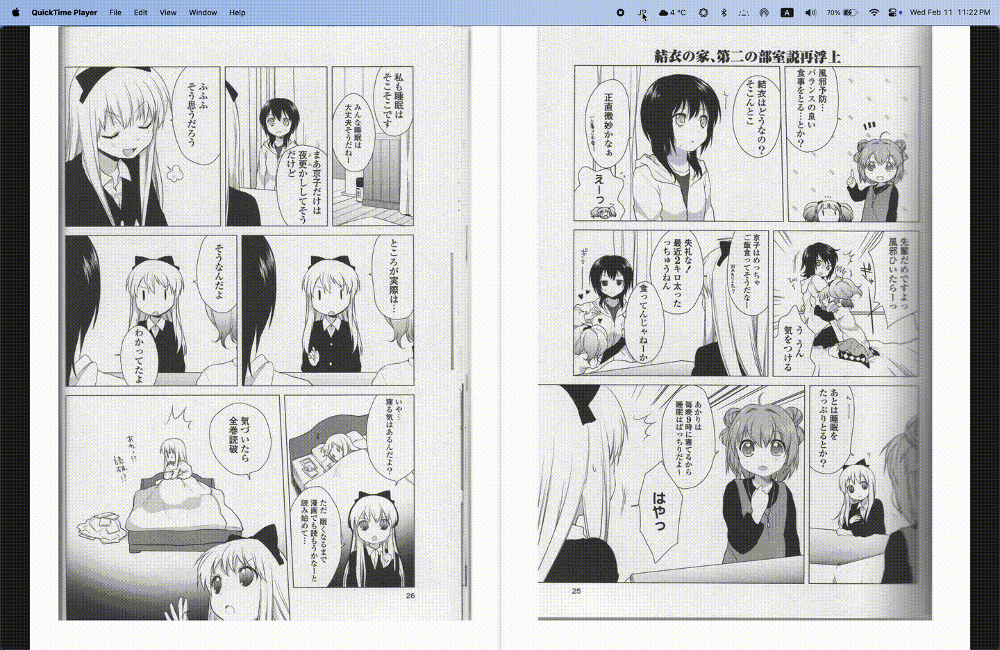
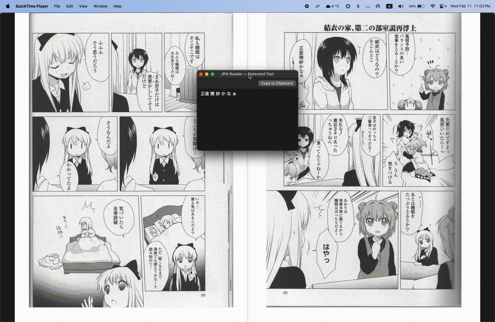
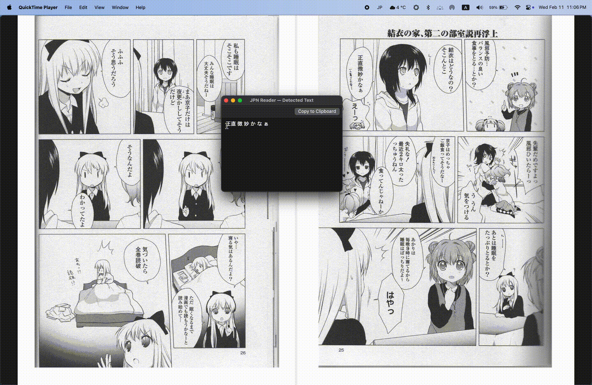

# JPNReader

A lightweight macOS menu bar app that captures a region of your screen and detects Japanese text using OCR. Supports both horizontal and vertical (tategaki) Japanese text, with built-in dictionary and translation lookups.


## Features

### Screen Region Capture
Select any area of your screen to extract Japanese text. A semi-transparent overlay with a crosshair cursor lets you draw a precise selection rectangle.

### Dual OCR Engines
- **Horizontal text** — Apple Vision framework with Japanese + English support
- **Vertical text (tategaki)** — Tesseract OCR with a dedicated `jpn_vert` model and vertical text page segmentation




### Floating Result Window
Detected text appears in a floating, resizable window that stays on top. Text is selectable and copyable.



### Right-Click Translation
Highlight any text in the result window and right-click to translate:
- **Translate with Jisho** — opens [jisho.org](https://jisho.org) dictionary lookup in an in-app browser
- **Translate with Google** — opens [Google Translate](https://translate.google.com) (JP → EN) in an in-app browser




### Global Hotkeys
Works system-wide, even when another app is in the foreground:

| Shortcut | Action |
|----------|--------|
| `Cmd+Shift+J` | Vertical text capture |
| `Cmd+Shift+K` | Horizontal text capture |
| `Escape` | Cancel capture |

### Image Preprocessing
Captured images are automatically enhanced before OCR:
- 2x upscaling for small text
- Grayscale conversion
- Contrast boost and sharpening

## Installation

### From DMG

1. Download `JPNReader.dmg` from [Releases](../../releases)
2. Open the DMG and drag **JPNReader** to **Applications**
3. Right-click the app → **Open** (required on first launch for unsigned apps)
4. Grant permissions when prompted (see below)

### From Source

**Requirements:** Xcode 15+, macOS 13+

```bash
git clone https://github.com/yourusername/JPNreaderAPP.git
cd JPNreaderAPP
brew install xcodegen
xcodegen generate
open JPNReader.xcodeproj
```

In Xcode:
1. Wait for Swift Package Manager to resolve dependencies
2. Add the `tessdata` folder to **Build Phases → Copy Files** (Destination: Resources)
3. Build & Run (Cmd+R)

### Building the DMG

```bash
# Build Release in Xcode first (Product → Build with Release configuration)
./build-dmg.sh
```

The signed DMG will be created at `~/Desktop/JPNReader.dmg`.

## Permissions

JPNReader requires two macOS permissions on first launch:

| Permission | Purpose | Location |
|------------|---------|----------|
| **Screen Recording** | Capturing screen regions for OCR | System Settings → Privacy & Security → Screen Recording |
| **Accessibility** | Global hotkeys (Cmd+Shift+J/K) | System Settings → Privacy & Security → Accessibility |

**Important:** You must quit and relaunch the app after granting each permission.

## Usage

1. Launch JPNReader — **"JP"** appears in the menu bar
2. Press `Cmd+Shift+J` (vertical) or `Cmd+Shift+K` (horizontal) from any app
3. Click and drag to select a screen region containing Japanese text
4. The detected text appears in a floating window
5. Highlight text and right-click to translate with Jisho or Google Translate


## Project Structure

```
JPNreaderAPP/
├── JPNReader/
│   ├── App/
│   │   ├── main.swift                # App entry point
│   │   └── AppDelegate.swift         # Lifecycle, permissions, main menu
│   ├── Capture/
│   │   ├── ScreenSelector.swift      # Full-screen overlay for region selection
│   │   └── ScreenCapturer.swift      # ScreenCaptureKit screen capture
│   ├── OCR/
│   │   └── TextRecognizer.swift      # Dual OCR engine (Tesseract + Vision)
│   ├── UI/
│   │   ├── StatusBarController.swift # Menu bar icon and menu
│   │   ├── ResultWindowController.swift # Floating text result window
│   │   ├── TranslatableTextView.swift   # Text view with translation context menu
│   │   └── WebPopupController.swift     # In-app browser for translations
│   ├── Utilities/
│   │   └── HotkeyManager.swift       # Global hotkeys via CGEvent tap
│   ├── Resources/
│   │   ├── Info.plist
│   │   └── JPNReader.entitlements
│   └── tessdata/
│       └── jpn_vert.traineddata      # Tesseract vertical Japanese model
├── project.yml                        # XcodeGen project spec
└── build-dmg.sh                       # DMG build & signing script
```

## Dependencies

| Package | Version | License | Purpose |
|---------|---------|---------|---------|
| [SwiftyTesseract](https://github.com/SwiftyTesseract/SwiftyTesseract) | 4.0.1 | MIT | Tesseract OCR Swift bindings |
| [libtesseract](https://github.com/nicklama/libtesseract) | 0.2.0 | Apache 2.0 | Tesseract C library |
| Apple Vision | Built-in | - | Horizontal text OCR |
| Apple ScreenCaptureKit | Built-in | - | Screen capture |
| Apple WebKit | Built-in | - | Translation web views |

## Acknowledgements

- Vertical text page segmentation approach based on [this StackOverflow answer](https://stackoverflow.com/a/78669720) by Basel (CC BY-SA 4.0)
- Japanese vertical text model from the [Tesseract tessdata repository](https://github.com/tesseract-ocr/tessdata)
